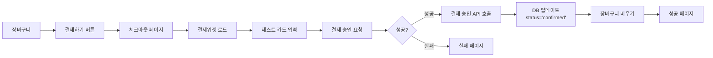

# Toss Payments V1 결제 통합 상세 계획

## 📋 개요

**목표**: Toss Payments V1 SDK를 사용하여 테스트 결제까지 구현
**제약사항**: 
- DB 스키마 변경 없음
- 결제 완료 시 `orders.status = 'confirmed'`만 업데이트
- V1 SDK 사용 (사업자 등록 불필요한 테스트 환경)

## 🔍 V1 vs V2 차이점 및 사업자 등록 요구사항 검증

### 검증 결과

**Toss Payments MCP 문서 분석 결과:**
- V1 결제위젯은 **테스트 키로 연동 가능** (사업자 등록 불필요)
- V1 문서에서 명시: "토스페이먼츠에 회원가입하기 전이라면, 다음 문서 테스트 키로 연동할 수 있어요"
- 결제위젯 어드민은 계약 완료 후 사용 가능하지만, **기본 결제위젯 기능은 테스트 키로 사용 가능**

**결론**: 
- ✅ V1을 사용하면 **사업자 등록 없이 테스트 결제 가능**
- ⚠️ 단, 라이브 환경에서는 계약 필요 (테스트 환경에서는 불필요)

## 🎯 결제 흐름 (V1 기준)

### 기본 흐름



### 단계별 상세 계획

## 1️⃣ 장바구니 → "결제하기" → 결제창 열기

### 구현 항목

#### 1.1 체크아웃 페이지 (`/checkout`)
- **현재 상태**: ✅ 이미 구현됨 (`app/checkout/page.tsx`)
- **결제위젯 통합**: ✅ 이미 통합됨 (`TossCheckoutForm`)
- **확인 사항**:
  - [ ] 배송 정보 입력 폼 검증
  - [ ] 장바구니 비어있을 때 리다이렉트 처리
  - [ ] 인증되지 않은 사용자 리다이렉트 처리

#### 1.2 결제위젯 초기화
- **현재 상태**: ✅ 이미 구현됨 (`components/payment/toss-payment-widget.tsx`)
- **확인 사항**:
  - [ ] 클라이언트 키 검증 로직 (이미 추가됨)
  - [ ] `customerKey` 형식 검증 (이미 추가됨)
  - [ ] 에러 핸들링 및 사용자 피드백

#### 1.3 주문 생성 (결제 요청 전)
- **현재 상태**: ✅ 이미 구현됨 (`createOrderDraftAction`)
- **확인 사항**:
  - [ ] 주문 상태: `pending`으로 생성
  - [ ] 주문 금액 검증
  - [ ] 주문 정보 저장 (배송지, 메모 등)

## 2️⃣ 결제창에서 테스트 카드 입력 → 승인

### 구현 항목

#### 2.1 테스트 카드 정보
- **테스트 카드 번호**: 문서 테스트 키 사용 시 일반 카드 번호 사용 가능
- **테스트 환경 특성**:
  - 실제 결제되지 않음
  - 카드사 인증은 가상으로 진행
  - 테스트 결제내역 메뉴에서 확인 가능

#### 2.2 결제 요청 (`requestPayment`)
- **현재 상태**: ✅ 이미 구현됨 (`components/payment/toss-payment-widget.tsx`)
- **파라미터 확인**:
  - [x] `orderId`: 주문 ID (UUID 형식)
  - [x] `orderName`: 주문명 (예: "여행 상품 외 2건")
  - [x] `amount`: 결제 금액 (KRW)
  - [x] `successUrl`: `/payments/success`
  - [x] `failUrl`: `/payments/fail`
  - [ ] `customerEmail`: 구매자 이메일 (Clerk에서 가져오기)
  - [ ] `customerName`: 구매자 이름 (Clerk에서 가져오기)

#### 2.3 결제창 열기
- **현재 상태**: ✅ Toss Payments V1 SDK로 자동 처리
- **확인 사항**:
  - [ ] 모바일 환경 대응 (iframe 사용 금지)
  - [ ] 결제수단 선택 UI 표시
  - [ ] 로딩 상태 표시

## 3️⃣ 성공 시 DB 업데이트, 장바구니 비우기

### 구현 항목

#### 3.1 결제 성공 페이지 (`/payments/success`)
- **현재 상태**: ✅ 이미 구현됨 (`app/payments/success/page.tsx`)
- **확인 사항**:
  - [x] `paymentKey`, `orderId`, `amount` 쿼리 파라미터 추출
  - [ ] **금액 검증**: 요청한 금액과 리다이렉트된 금액 일치 확인
  - [ ] 주문 조회 및 상태 확인 (`pending`인지 확인)

#### 3.2 결제 승인 API 호출 (`/api/payments/confirm`)
- **현재 상태**: ✅ 이미 구현됨 (`app/api/payments/confirm/route.ts`)
- **확인 사항**:
  - [ ] **서버 사이드 금액 검증**: DB의 주문 금액과 일치 확인
  - [ ] Toss Payments 승인 API 호출
  - [ ] 승인 성공 후 주문 상태 업데이트 (`status = 'confirmed'`)
  - [ ] 장바구니 비우기 (`cart_items` 테이블에서 삭제)

#### 3.3 DB 업데이트 로직
- **필요 작업**:
  ```typescript
  // 1. 주문 조회
  const order = await supabase
    .from('orders')
    .select('*')
    .eq('id', orderId)
    .eq('clerk_id', userId)
    .single();

  // 2. 금액 검증
  if (order.total_amount !== amount) {
    throw new Error('결제 금액 불일치');
  }

  // 3. 결제 승인 API 호출
  const paymentResult = await confirmPaymentAPI(paymentKey, orderId, amount);

  // 4. 주문 상태 업데이트
  await supabase
    .from('orders')
    .update({ status: 'confirmed' })
    .eq('id', orderId);

  // 5. 장바구니 비우기
  await supabase
    .from('cart_items')
    .delete()
    .eq('clerk_id', userId);
  ```

## 4️⃣ 실패 시 안내만 제공

### 구현 항목

#### 4.1 결제 실패 페이지 (`/payments/fail`)
- **현재 상태**: ✅ 이미 구현됨 (`app/payments/fail/page.tsx`)
- **확인 사항**:
  - [ ] 에러 코드별 안내 메시지
  - [ ] 재시도 버튼 (체크아웃 페이지로 이동)
  - [ ] 장바구니로 돌아가기 버튼

#### 4.2 실패 케이스 처리
- **주요 실패 케이스**:
  - 사용자 취소 (`USER_CANCEL`)
  - 카드 한도 초과
  - 네트워크 오류
  - 타임아웃 (10분 초과)

## 📊 데이터베이스 스키마 (변경 없음)

### 현재 스키마 구조

```sql
-- orders 테이블
CREATE TABLE orders (
    id UUID PRIMARY KEY,
    clerk_id TEXT NOT NULL,
    total_amount DECIMAL(10,2) NOT NULL,
    status TEXT NOT NULL DEFAULT 'pending'
        CHECK (status IN ('pending', 'confirmed', 'shipped', 'delivered', 'cancelled')),
    shipping_address JSONB,
    order_note TEXT,
    created_at TIMESTAMPTZ DEFAULT now(),
    updated_at TIMESTAMPTZ DEFAULT now()
);

-- order_items 테이블
CREATE TABLE order_items (
    id UUID PRIMARY KEY,
    order_id UUID REFERENCES orders(id),
    product_id UUID REFERENCES products(id),
    product_name TEXT NOT NULL,
    quantity INTEGER NOT NULL,
    price DECIMAL(10,2) NOT NULL,
    created_at TIMESTAMPTZ DEFAULT now()
);
```

### 결제 완료 시 업데이트할 필드

- ✅ `orders.status`: `'pending'` → `'confirmed'`
- ❌ 추가 필드 변경 없음 (요구사항 준수)

## 🔐 보안 및 검증 사항

### 필수 검증 로직

1. **클라이언트 사이드 금액 검증**
   - 결제 요청 전 주문 금액 저장
   - 성공 URL의 `amount`와 비교

2. **서버 사이드 금액 검증**
   - DB의 주문 금액과 승인 API 호출 전 비교
   - 불일치 시 결제 취소

3. **주문 상태 검증**
   - 승인 API 호출 전 주문 상태가 `pending`인지 확인
   - 중복 승인 방지

4. **사용자 권한 검증**
   - 주문의 `clerk_id`와 현재 사용자 ID 일치 확인

## 📝 구현 체크리스트

### Phase 4-1: 결제위젯 통합 (완료 ✅)
- [x] 결제위젯 컴포넌트 생성
- [x] 체크아웃 폼에 통합
- [x] 클라이언트 키 검증
- [x] 에러 핸들링

### Phase 4-2: 결제 승인 처리 (진행 중)
- [x] 결제 승인 API 라우트 생성
- [ ] **금액 검증 로직 강화** (서버 사이드)
- [ ] **주문 상태 검증** (pending 확인)
- [ ] **장바구니 비우기** (결제 성공 시)
- [ ] 결제 정보 저장 (`paymentKey` 등)

### Phase 4-3: 에러 처리 및 사용자 경험
- [x] 결제 성공/실패 페이지 생성
- [ ] 에러 코드별 안내 메시지
- [ ] 로딩 상태 표시
- [ ] 토스트 알림 통합

### Phase 4-4: 테스트 및 검증
- [ ] 테스트 카드로 결제 플로우 테스트
- [ ] 금액 불일치 시나리오 테스트
- [ ] 네트워크 오류 시나리오 테스트
- [ ] 중복 승인 방지 테스트

## 🎨 추천 추가 구현 사항

### 1. 결제 정보 저장 (선택 사항)
결제 이력을 추적하기 위해 `orders` 테이블에 결제 정보 필드 추가 고려:
- `payment_key`: Toss Payments에서 발급한 결제 키
- `payment_method`: 결제 수단 (카드, 간편결제 등)
- `payment_confirmed_at`: 결제 승인 시각

**주의**: 요구사항에서 DB 스키마 변경 없음이라고 명시했으므로, 이는 향후 확장 계획으로만 고려

### 2. 주문 상세 페이지 개선
- 결제 완료된 주문에 결제 정보 표시
- 결제 수단, 승인 시각 등 정보 제공

### 3. 관리자 대시보드 (향후)
- 결제 완료 주문 목록 조회
- 결제 실패 통계
- 환불 처리

## ⚠️ 주의사항

### Toss Payments V1 제약사항

1. **SDK 업데이트 중단**
   - V1 SDK는 더 이상 업데이트되지 않음
   - V2로 마이그레이션 시점 검토 필요

2. **테스트 환경**
   - 테스트 키로 연동 시 실제 결제되지 않음
   - 개발자센터 > 테스트 결제내역에서 확인 가능

3. **결제 승인 타임아웃**
   - `successUrl` 리다이렉트 후 **10분 이내**에 승인 API 호출 필요
   - 초과 시 결제 만료

4. **모바일 환경**
   - iframe 사용 금지
   - 결제창은 전체 페이지로 이동

## 📚 참고 자료

- [Toss Payments V1 결제위젯 연동 가이드](https://docs.tosspayments.com/guides/payment-widget/integration)
- [결제 승인 API 문서](https://docs.tosspayments.com/reference#결제-승인)
- [에러 코드 목록](https://docs.tosspayments.com/reference/error-codes)

