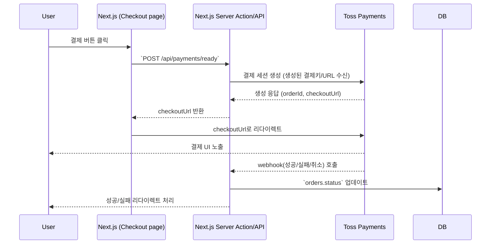

## Toss Payments MCP 통합 준비 문서

### 1. 요구사항 및 환경 변수 정리

- **필수 환경 변수 (Vercel + 로컬 `.env` 동기화)**
  - `TOSS_PAYMENTS_SECRET_KEY` (테스트 시크릿 키)
  - `NEXT_PUBLIC_TOSS_PAYMENTS_CLIENT_KEY` (테스트 클라이언트 키)
  - `NEXT_PUBLIC_APP_URL` (결제 완료/취소 리다이렉트 베이스 URL)
  - 검토: 주문 상태 업데이트용 서버 액션에서 사용할 `TOSS_PAYMENTS_WEBHOOK_SECRET` 필요 여부
- **보관 위치**
  - 로컬: `.env.local`
  - Vercel: Project Settings → Environment Variables (Production/Preview 분리 입력)
- **Order Status 매핑 초안**
  | Toss 이벤트 | `orders.status` 값 |
  |-------------|---------------------|
  | 결제 성공 (`DONE`) | `confirmed` |
  | 결제 취소 (`CANCELED`) | `cancelled` |
  | 결제 실패 | `pending` 유지 + 실패 로그 |
  | 배송 처리 후 | `shipped` (별도 처리 예정) |
- **참고 링크**: [Toss Payments 문서](https://docs.tosspayments.com/reference), [MCP 가이드](https://mdc.tosspayments.com)

### 2. 결제 플로우 시나리오

- **성공 흐름**: 웹훅 수신 → 주문 상태 `confirmed` → 주문 상세 페이지 이동
- **실패/취소 흐름**: 주문 상태 업데이트 (`cancelled`) 후 장바구니 페이지로 복귀 + 토스트 알림

### 3. 통합 구현 준비

- **엔드포인트 설계**
  - `POST /api/payments/ready`: 결제 세션 생성 (Server Action 우선, 필요 시 Route Handler)
  - `POST /api/payments/webhook`: Toss에서 전달하는 이벤트 처리 → 시크릿 검증
  - `GET /api/payments/lookup?id=` (옵션): 결제 상태 확인용
- **서버 액션 구성**
  - `actions/payments.ts` 내 `createPaymentSession`, `handlePaymentSuccess`, `handlePaymentFailure`
  - MCP SDK 초기화 (secret key 사용)
- **필요 유틸리티**
  - 주문 금액/항목 변환 함수 (장바구니 → Toss 파라미터)
  - Toss 이벤트 타입 정의 (TypeScript)

### 4. UI / UX 초안

- **Checkout 페이지**
  - 결제 수단 선택 컴포넌트 (신용카드, 가상계좌 등 – Toss 리스트 기반)
  - 결제 버튼 클릭 시 로딩 상태 + 오류 핸들링
- **결제 완료 페이지**
  - 결제 요약 (결제 금액, 결제 수단, 주문번호)
  - 주문 상세 보기 버튼 + 쇼핑 계속하기 버튼
- **결제 실패/취소 처리**
  - 실패 메시지 모달 → 장바구니로 돌아가기 CTA
  - 실패 로그는 `console.error` + Sentry 등 연계 고려

### 5. 테스트 / 배포 전략

- **테스트 케이스**
  1. 결제 성공: 정상 웹훅 → 상태 `confirmed`
  2. 결제 취소: 사용자가 UI에서 취소 → 상태 `cancelled`
  3. 결제 실패: 의도적으로 실패 응답 → 알림 + 상태 유지
  4. 중복 웹훅: idempotency 보장 (이미 처리된 주문은 무시)
- **로그/모니터링**
  - Server Action에서 `console.group`으로 Toss 이벤트 기록
  - Vercel Log Drain 또는 Sentry 연결 검토
- **배포 단계**
  1. 로컬 테스트 (`NEXT_PUBLIC_APP_URL=http://localhost:3000`)
  2. Vercel Preview에서 Toss 테스트 키로 검증
  3. Production에 테스트 키 유지 (실 결제 전) → 필요 시 실 키로 교체

