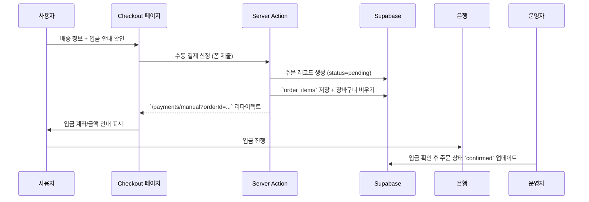

## 수동 입금(계좌이체) 결제 플로우 안내

### 1. 개요

- 외부 PG 연동 없이, 사용자가 지정된 계좌로 직접 입금하는 방식으로 주문을 완료합니다.
- 주문 생성 시 상태는 `pending`으로 유지되며, 운영자가 입금 확인 후 `confirmed`로 변경합니다.
- 모든 절차는 Server Action과 Supabase 테이블만으로 처리되며 추가 환경 변수가 필요하지 않습니다.

### 2. 사용자 흐름

### 3. 화면 구성

- **Checkout 페이지 (`app/checkout/page.tsx`)**
  - 배송지, 연락처, 메모 입력 폼 유지
  - “입금 안내” 카드에 계좌번호·입금 기한·주의 사항 표기
  - 제출 버튼 문구를 `주문 신청하기`로 변경

- **입금 안내 페이지 (`app/payments/manual/page.tsx`)**
  - 주문 번호와 생성 시각을 보여주고, 금액/계좌 정보를 강조
  - 입금 후 진행 안내 및 고객센터 연락처 안내
  - 주문 상세 보기 / 다른 상품 둘러보기 CTA 제공

- **주문 상세 (`app/orders/[id]/page.tsx`)**
  - 상태가 `pending`인 경우 “입금 대기” 배지 표시
  - 운영자가 확인 후 상태를 수동으로 업데이트

### 4. 서버 처리 요약

- `submitManualPaymentAction`
  - `checkoutSchema`로 입력 검증 → `createOrderDraft` 호출 (`clearCart: true`)
  - `orders` + `order_items`에 데이터 적재, 장바구니 비움
  - `/payments/manual?orderId=...` 로 리다이렉트
  - `/cart`, `/mypage` 등 관련 경로를 revalidate

- `fetchOrderDetailForUser`
  - 수동 결제 페이지와 주문 상세 페이지에서 재사용
  - Clerk ID와 주문 ID를 함께 검증하여 보안 유지

### 5. 운영 체크리스트

- 입금 확인 시 관리자가 Supabase 콘솔에서 `orders.status`를 `confirmed`로 직접 변경 (추후 관리 UI 고려)
- 입금 기한 초과 시 `cancelled` 상태로 수동 변경 후 고객에게 안내
- 고객 문의용 템플릿 문구(계좌번호, 입금 기한, 연락처)를 문서화하여 일관되게 응답

### 6. 테스트 포인트

1. 장바구니 → 체크아웃 → 주문 신청 → `/payments/manual` 이동 여부 확인
2. Supabase `orders`/`order_items`에 데이터가 정확히 생성되고 `cart_items`가 비워지는지 검증
3. 로그인하지 않은 상태에서 접근 시 Clerk 로그인 페이지로 리다이렉트되는지 확인
4. 주문 상세 페이지에서 상태와 금액이 정상 표시되는지 확인

필요 시 입금 확인 자동화를 위해 추후 웹훅이나 엑셀 업로드 기능을 도입할 수 있습니다. 현재는 간단한 수동 프로세스를 통해 운영 비용을 최소화합니다.
